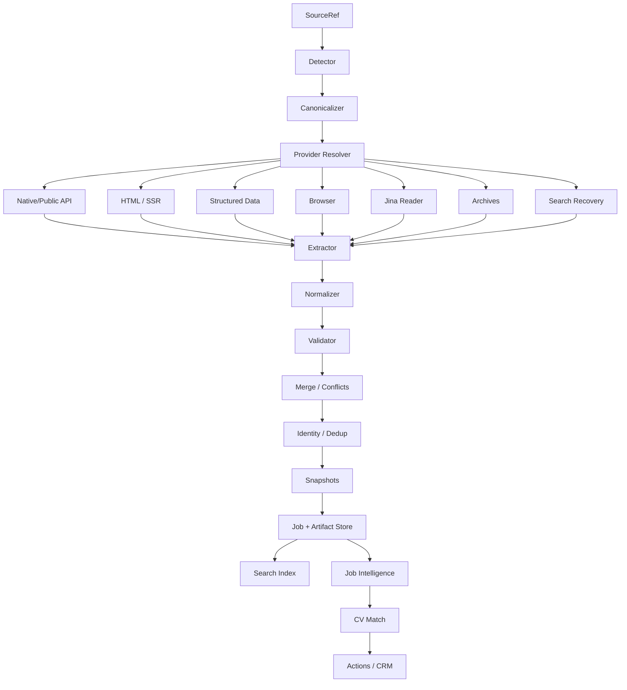

# CareerOS — ClaudeCode Master Prompt

## Universal Job Intelligence Platform

### Branch-aware repository archaeology, multi-platform vacancy acquisition, provenance, search, matching and CareerOS integration

You are working inside the existing **CareerOS** repository:

`github.com/hnkovr/CareerOS`

The repository itself is the primary source of truth.

Your task is **not** to add another isolated scraper.

Your task is to inspect the complete repository, including **all local branches, all remote branches, tags, merge history, abandoned experiments, tests, docs and partially implemented features**, and then evolve the existing codebase into a maintainable **Universal Job Intelligence Platform** integrated with CareerOS.

The original immediate problem is resilient vacancy reading from sites such as HeadHunter, but the architecture must support the broader CareerOS workflow:

```text
Discover
  ↓
Read
  ↓
Verify
  ↓
Normalize
  ↓
Deduplicate
  ↓
Track changes
  ↓
Analyze
  ↓
Match against CV
  ↓
Tailor CV
  ↓
Generate outreach
  ↓
Apply
  ↓
Track pipeline
  ↓
Prepare interview
  ↓
Learn from outcomes
```

Do not optimize for “number of scrapers”.

Optimize for:

```text
correctness
provenance
maintainability
graceful degradation
testability
cost
latency
privacy
compliance
extensibility
```

---

# 0. Core operating principles

Follow these rules throughout the task.

1. Inspect before modifying.
2. Study **all branches** before designing.
3. Repository reality beats assumptions in this prompt.
4. Reuse existing code before writing replacements.
5. Prefer deterministic parsing over LLM parsing.
6. Prefer native/public APIs over HTML.
7. Prefer public structured HTML over browser automation.
8. Browser rendering is a fallback, not a default.
9. Do not bypass CAPTCHAs, WAFs, authentication or paid access controls.
10. Preserve source provenance.
11. Never silently overwrite contradictory data.
12. Keep historical snapshots.
13. Do not hallucinate missing vacancy fields.
14. Keep local-first deployments lightweight.
15. Do not introduce infrastructure merely because it sounds scalable.
16. Interfaces may anticipate scale; runtime infrastructure should match current needs.
17. Keep acquisition separate from analysis.
18. Keep analysis separate from action/application automation.
19. Preserve backward compatibility wherever practical.
20. Do not stop after producing an architecture document: implement the highest-value coherent slice.

---

# 1. FIRST: audit ALL Git branches

Do not start implementation until this is complete.

Run:

```bash
git status --short --branch
git remote -v

git fetch --all --prune --tags

git branch -vv
git branch -a

git tag --list --sort=-creatordate

git for-each-ref \
  --sort=-committerdate \
  --format='%(refname:short)%09%(objectname:short)%09%(committerdate:iso8601)%09%(subject)' \
  refs/heads refs/remotes refs/tags

git log \
  --graph \
  --decorate \
  --oneline \
  --all \
  --date-order \
  --max-count=1000

git log \
  --all \
  --merges \
  --decorate \
  --oneline \
  --max-count=500
```

Determine the actual mainline branch.

Do not blindly assume `main`.

For every significant branch calculate:

```bash
git merge-base <mainline> <branch>

git rev-list \
  --left-right \
  --count \
  <mainline>...<branch>

git log \
  <mainline>..<branch> \
  --oneline \
  --decorate

git diff \
  --stat \
  <mainline>...<branch>

git diff \
  --name-status \
  <mainline>...<branch>

git ls-tree \
  -r \
  --name-only \
  <branch>
```

Inspect branch content without destructively switching branches.

Prefer:

```bash
git show <ref>:<path>
```

or temporary worktrees:

```bash
git worktree add --detach /tmp/careeros-<branch> <branch>
```

Never destroy uncommitted user work.

Do not use:

```bash
git reset --hard
git clean -fd
```

unless explicitly instructed by the user.

---

# 2. Build a branch archaeology matrix

Before coding, create a report similar to:

| Ref          | Tip | Ahead/behind | Theme     | Unique implementation | Status   | Recommendation |
| ------------ | --- | -----------: | --------- | --------------------- | -------- | -------------- |
| mainline     | ... |     baseline | current   | ...                   | current  | base           |
| feature/...  | ... |          ... | ingestion | provider abstraction  | unmerged | reuse          |
| spike/...    | ... |          ... | scraping  | Playwright code       | stale    | port concept   |
| refactor/... | ... |          ... | models    | JobSource model       | partial  | inspect        |
| release/...  | ... |          ... | migration | schema changes        | merged   | history only   |

For each branch explicitly classify:

```text
fully merged
partially merged
unmerged
superseded
experimental
abandoned but useful
conflicting
unknown
```

Identify:

* code to reuse;
* concepts to port;
* tests that reveal intended behavior;
* migrations that constrain schema changes;
* code that should not be duplicated;
* competing implementations;
* branches containing provider-specific readers;
* branches containing search code;
* branches containing recruiter-message ingestion;
* branches containing CV/job matching;
* branches containing MCP/API/CLI work.

---

# 3. Search ALL refs for existing work

Search across branches for terms equivalent to:

```text
job
jobs
vacancy
vacancies
position
opportunity

source
provider
adapter
parser
scraper
crawler
fetch
reader
extractor

hh
headhunter
linkedin
wellfound
upwork
toptal
justjoin
rockethunt
getmatch
djinni
nofluffjobs

greenhouse
lever
ashby
workday
smartrecruiters
recruitee
workable
teamtailor

playwright
beautifulsoup
httpx
requests
jina
wayback
archive

resume
cv
match
fit
cover
application
recruiter
contact
pipeline

mcp
api
cli
scheduler
cache
retry
```

Use `git grep` across refs where useful.

Do not reimplement something just because it does not exist on the currently checked-out branch.

---

# 4. Inspect repository architecture

Study actual files and conventions.

At minimum inspect:

```text
README*
CLAUDE.md
AGENTS.md
CONTRIBUTING*
ROADMAP*
TODO*
docs/**
adr/**
rfcs/**

pyproject.toml
requirements*.txt
uv.lock
poetry.lock

package.json
package-lock.json
pnpm-lock.yaml

Dockerfile*
docker-compose*
Makefile
Taskfile*

.github/**
.gitlab-ci*
pre-commit
linters
formatters
type checking

tests/**
migrations/**
scripts/**
```

Locate actual implementations for:

```text
Job
Vacancy
Position
Opportunity

Company
Recruiter
Contact

Application
Pipeline

Resume
CV
ResumeVersion

JobSource
Source
Provider

fit_score
match_score

Job ingestion
URL reader
search
JD parser
document parsing

AI providers
prompt infrastructure
MCP
CLI
REST API
frontend
storage
cache
HTTP utilities
logging
```

---

# 5. Produce a current-state report

Before significant modifications explain:

### Existing architecture

```text
current modules
current data flow
current storage
current entry points
current dependency boundaries
```

### What is already good

Explicitly identify abstractions worth preserving.

### Current problems

Examples:

```text
provider-specific code embedded in UI
fetching mixed with parsing
parsing mixed with LLM analysis
URL-specific assumptions
no provenance
no snapshots
weak errors
no cache
duplicated HTTP code
```

Only report problems actually supported by repository evidence.

---

# 6. Write an RFC before major changes

Create according to repository convention, for example:

```text
docs/rfcs/universal-job-intelligence.md
```

The RFC should include:

1. Context
2. Current state
3. Problems
4. Goals
5. Non-goals
6. Constraints
7. Alternatives
8. Provider taxonomy
9. Domain model
10. Provider architecture
11. Fetch strategies
12. Search architecture
13. Provenance
14. Snapshot/versioning
15. Deduplication
16. Conflict resolution
17. Storage
18. Cache
19. Rate limiting
20. LLM boundary
21. REST/CLI/MCP
22. Observability
23. Privacy/security
24. Migration
25. Testing
26. Rollout
27. Risks
28. Open questions
29. Acceptance criteria

Do not stop after the RFC.

Proceed with implementation.

---

# 7. Target architecture

CareerOS should evolve toward:

```text
Source
  ↓
Detection
  ↓
Canonicalization
  ↓
Provider Resolution
  ↓
Acquisition Strategy
  ↓
Fetch Artifact
  ↓
Extraction
  ↓
Normalization
  ↓
Validation
  ↓
Provenance
  ↓
Merge
  ↓
Deduplication
  ↓
Snapshot
  ↓
Storage
  ↓
Search/Index
  ↓
Job Intelligence
  ↓
CV Match
  ↓
Actions / Application CRM
```

These stages should be conceptually separable.

Do not make one huge:

```python
scrape_and_analyze_job()
```

function.

---

# 8. Source abstraction

A source is not necessarily a URL.

Support a model conceptually equivalent to:

```python
SourceRef(
    kind=...,
    value=...,
    provider_hint=...,
    metadata=...,
)
```

Possible kinds:

```text
url
provider_id
search_result
api
rss
html
markdown
text
pdf
docx
email
telegram_message
slack_message
discord_message
linkedin_message
file
archive
repost
manual
```

A source may reference another source.

Example:

```text
RocketHunt
    ↓
Telegram post
    ↓
Employer careers page
    ↓
Ashby posting
```

Preserve those relationships.

---

# 9. Provider abstraction

Build or extend a generic provider system.

Conceptual interface:

```python
class JobProvider(Protocol):
    name: str

    def detect(
        self,
        source: SourceRef,
    ) -> DetectionResult: ...

    def canonicalize(
        self,
        source: SourceRef,
    ) -> CanonicalSource: ...

    async def fetch(
        self,
        request: FetchRequest,
    ) -> FetchResult: ...

    async def search(
        self,
        request: JobSearchQuery,
    ) -> SearchResult: ...
```

Do not require unsupported capabilities.

---

# 10. Provider capability registry

Providers should declare capabilities.

Conceptually:

```python
ProviderCapabilities(
    fetch_by_url=True,
    fetch_by_external_id=True,
    search=False,
    list_company_jobs=False,
    fetch_company=False,
    fetch_recruiter=False,
    native_api=True,
    public_html=True,
    browser_render=False,
    archive_recovery=True,
    authentication_mode="public",
)
```

Useful metadata:

```text
authoritativeness
expected latency
cost tier
rate limits
requires API key
requires browser
supports archives
supports search
```

This allows intelligent strategy resolution.

---

# 11. Platform/provider scope

Research architecture/support for all of the following.

## General job boards

```text
HeadHunter
LinkedIn Jobs
Wellfound
Indeed
Glassdoor
Dice
Monster
ZipRecruiter
XING
Habr Career
Getmatch
Djinni
Remote OK
We Work Remotely
Landing.jobs
JustJoin.it
No Fluff Jobs
Bulldogjob
RocketHunt
```

## Freelance / talent marketplaces

```text
Upwork
Toptal
Braintrust
Contra
Freelancer
```

## ATS / career systems

```text
Greenhouse
Lever
Ashby
Workday
SmartRecruiters
Recruitee
Workable
BambooHR
Personio
Oracle Recruiting
Taleo
SAP SuccessFactors
iCIMS
Jobvite
Comeet
Teamtailor
Pinpoint
Homerun
JOIN.com
```

## Generic employer sites

Support detection of:

```text
JSON-LD JobPosting
microdata
SSR HTML
Next.js __NEXT_DATA__
Nuxt payload
public JSON endpoints
public GraphQL endpoints
RSS
Atom
XML feeds
sitemaps
```

## Recruiter/inbound sources

Architect adapters for user-authorized:

```text
Gmail
email files
Telegram
Slack
Discord
LinkedIn messages
manual pasted messages
```

Do not claim support that is not implemented.

Maintain a provider capability matrix.

---

# 12. Explicitly include RocketHunt

Service:

`https://rockethunt.ai`

Treat RocketHunt as:

```text
job board
+
aggregator
+
potential bridge to original source
```

Public vacancy URLs currently use a form equivalent to:

```text
https://rockethunt.ai/en/vacancies/<uuid>
```

But verify current behavior during implementation.

Do not assume a documented API exists.

Preferred strategy:

```text
public SSR/HTML
    ↓
embedded structured state
    ↓
public JSON endpoint if genuinely public and verified
    ↓
Jina Reader
    ↓
archive
    ↓
search recovery
```

Extract public visible fields such as:

```text
title
company
skills
salary when explicitly listed
location
relocation
experience
employment
work format
grade
English level
specialization
industry
company type
description
requirements
responsibilities
benefits
publication information
original language
```

Important distinction:

RocketHunt may show:

```text
Contacts
Show contacts
```

Do **not** bypass that gate.

Do not:

```text
reverse private endpoints
steal auth tokens
automate paid-contact unlocking
circumvent login
```

If public job text contains an openly visible recruiter handle/email as part of the original description, preserve it according to existing privacy policy.

If the source/original vacancy link is publicly present:

```text
RocketHuntSource
     ↓ aggregates
OriginalSource
```

Resolve the original source through the normal CareerOS provider resolver.

Do not discard RocketHunt provenance.

---

# 13. Explicitly include JustJoin.it

Service:

`https://justjoin.it/`

Treat JustJoin.it as a first-class Polish/EU technical job-board provider.

Current public integrations indicate an endpoint family equivalent to:

```text
/api/candidate-api/offers
```

Older integrations also refer to:

```text
/api/offers
```

These endpoints are not a permanent contract from CareerOS's perspective.

Therefore ClaudeCode must:

1. verify current endpoint behavior;
2. record verification date;
3. prefer the current candidate/public endpoint;
4. treat legacy endpoint as fallback only if verified;
5. make parsing tolerant to additive fields;
6. detect structural schema changes;
7. retain raw payload;
8. implement pagination correctly;
9. avoid frozen enums for evolving categories;
10. test contract variations.

Normalize where available:

```text
title
company
company slug/id
locations
country
city
workplaceType
remote/hybrid/office
remote interview
experience
seniority
skills
category
contract type
salary
currency
salary period
publication time
expiry
canonical URL
apply URL
```

Keep category, currency and contract handling extensible.

Do not assume values are static.

---

# 14. HeadHunter provider

HeadHunter should be a reference implementation for resilient multi-strategy fetching.

Support URL forms such as:

```text
https://hh.ru/vacancy/136537758
https://hh.ru/vacancy/136537758?from=share_ios
```

Canonical result:

```text
provider = hh
external_id = 136537758
canonical URL = /vacancy/136537758
```

### Strategy priority

Prefer:

```text
Official HH API
    ↓
Direct HH HTML
    ↓
Jina Reader
    ↓
regional HeadHunter frontend
    ↓
Wayback
    ↓
archive.today
    ↓
search/repost recovery
```

Do not necessarily call every strategy.

Stop when sufficient authoritative data is recovered.

---

# 15. HH API

Prefer the official vacancy API.

Conceptually:

```text
GET api.hh.ru/vacancies/{vacancy_id}
```

Use a valid configurable application user-agent.

Recognize different semantics for:

```text
200 success
403 blocked/CAPTCHA/access condition
404 missing/closed/private
429 rate limited
5xx server failure
network timeout
malformed payload
```

Do not collapse all failures into:

```python
return None
```

Preserve structured fields supplied by the API.

Where current official documentation supports it, handle:

```text
host
locale
```

Regional hosts should be configuration/data, not scattered hardcoded branches.

Candidate hosts include:

```text
hh.ru
hh.kz
headhunter.ge
headhunter.kg
hh.uz
rabota.by
hh1.az
```

Verify current validity.

---

# 16. Jina Reader

Implement Jina Reader as a generic fetch strategy rather than an HH-only hack.

Conceptual target:

```text
r.jina.ai/<public-url>
```

Optional configuration:

```text
JINA_API_KEY
```

Support anonymous/basic mode if currently available.

Jina output should be treated as:

```text
transformed representation
```

not authoritative provider metadata.

Native provider data wins for structured fields.

---

# 17. Archive support

Implement generic historical recovery.

## Wayback

Use CDX/search facilities to locate snapshots.

Store:

```text
original URL
archive URL
capture timestamp
content hash
```

Never represent:

```text
archive capture date
```

as:

```text
job publication date
```

A useful flow:

```text
current source → 404
     ↓
Wayback
     ↓
latest usable historical snapshot
     ↓
recover description
     ↓
mark historical/closed
```

## archive.today / archive.ph

Best-effort adapter only.

Failure must not break ingestion.

---

# 18. Search recovery

Last-resort recovery can search for:

```text
"<provider job id>"
"<job title>" "<company>"
"<job title>" site:<company>
```

Potential search strategy:

```text
Jina Search
existing CareerOS web search
search-engine abstraction
```

Search results have lower authority.

Store provenance:

```text
search query
result URL
result title
source domain
content
confidence
```

Never silently pretend a repost is the original job.

---

# 19. Generic structured extraction

Before LLM extraction, attempt:

```text
native JSON
JSON-LD JobPosting
microdata
embedded app state
Next.js state
provider-specific JSON
semantic HTML
Markdown structure
```

Create reusable extraction functions for:

```text
title
company
description
responsibilities
requirements
nice-to-have
skills
benefits

location
remote mode
salary
currency
salary period

employment
contract
seniority
experience
language requirements

publish date
expiration date
apply URL
canonical URL
```

---

# 20. Browser rendering

Use Playwright or equivalent only if actually needed.

Use it when:

```text
direct HTML is an empty JS shell
and
no public structured source exists
```

Browser rendering must be optional if practical.

Do not add:

```text
stealth plugins
fingerprint spoofing
CAPTCHA bypass
residential proxies
cookie stealing
```

---

# 21. Fetch result model

Reuse the current model if possible.

Otherwise introduce a concept equivalent to:

```python
class FetchArtifact:
    provider: str

    requested_url: str | None
    resolved_url: str | None

    external_id: str | None

    fetched_at: datetime

    status_code: int | None
    content_type: str | None

    raw_text: str | None
    raw_json: dict | list | None

    is_archive: bool
    archive_timestamp: datetime | None

    cache_status: str | None
    duration_ms: int | None

    quality_score: float | None
    completeness_score: float | None
    confidence: float | None

    error_type: str | None
    error_message: str | None
```

Adapt naming/style to actual repository conventions.

---

# 22. HTTP 200 does not mean success

Implement content validation.

Detect:

```text
CAPTCHA
login page
cookie interstitial
Cloudflare/WAF page
generic error page
empty shell
job closed page
search result page
unrelated redirect
```

A result should have quality signals.

Conceptually:

```python
result.is_usable()
result.quality_score
result.completeness_score
```

Useful evidence:

```text
job-specific title
company
meaningful description
provider/external ID consistency
JobPosting structure
skills
location
salary where available
```

---

# 23. Canonical job model

Reuse existing CareerOS model where suitable.

Do not create a second competing `Job` domain model without strong reason.

Conceptually normalize:

```text
job_id
canonical_key

title
company

locations
remote policy

employment type
contract types

seniority
experience

salary
currency
salary period

skills

description
responsibilities
requirements
nice_to_have
benefits

industry
specialization

language requirements

apply_url
canonical_url

published_at
expires_at

status
```

Do not invent unavailable values.

---

# 24. Provenance

Source provenance is mandatory.

At job level retain:

```text
provider
provider job ID
source URL
original URL
resolved URL
retrieved time
source publication time
content hash
archive status
```

Where practical retain field-level evidence.

Conceptual example:

```python
FieldEvidence(
    field="salary.min",
    value=5000,
    source="employer_api",
    source_url=...,
    observed_at=...,
    confidence=0.99,
)
```

Example:

```text
title
  ← employer ATS

description
  ← employer ATS

skills
  ← RocketHunt

salary
  ← recruiter email
```

---

# 25. Authority ordering

General authority preference:

```text
employer native ATS/API
    >
employer career page
    >
native job-board structured source
    >
current original HTML
    >
trusted aggregator
    >
archive
    >
search result/repost
    >
LLM inference
```

This is a guideline, not a blind universal rule.

Provider-specific policies may override it.

---

# 26. Conflict handling

Never use unconditional last-write-wins.

If sources disagree on:

```text
salary
location
remote policy
contract
seniority
title
experience
```

retain conflicts.

Conceptual representation:

```python
ResolvedField(
    value=...,
    confidence=...,
    evidence=[...],
    conflicts=[...],
)
```

If the current CareerOS schema is simpler, implement a lightweight compatible approach first.

---

# 27. Snapshots and change history

A job should support historical versions.

Conceptually:

```text
Job
 ├── Snapshot v1
 ├── Snapshot v2
 └── Snapshot v3
```

Create a new snapshot only for meaningful changes.

Track:

```text
salary changed
remote policy changed
requirements changed
job closed
job reopened
description changed
location changed
apply URL changed
```

Compute normalized fingerprints that exclude volatile page noise.

Support answering:

```text
What changed since the last refresh?
```

---

# 28. Raw artifact storage

Preserve enough source material to reprocess later.

Potential artifacts:

```text
raw JSON
HTML
Markdown
provider API payload
archive payload
search result
```

Store content hash.

Never store:

```text
auth headers
cookies
API keys
private session secrets
```

If DB size is a concern, introduce:

```text
ArtifactStore
```

with baseline:

```text
LocalArtifactStore
```

and optional future:

```text
S3ArtifactStore
GCSArtifactStore
```

Do not require cloud storage now.

---

# 29. Deduplication

The same vacancy can exist on:

```text
employer career site
ATS
LinkedIn
JustJoin
RocketHunt
Telegram
email
search cache
```

Do not deduplicate only by URL.

Use layered identity evidence:

```text
exact provider ID
canonical original URL
ATS job ID
company + title + location
company + title + description fingerprint
semantic similarity
```

Represent:

```text
same_as
repost_of
aggregates
mirrors
possible_duplicate
historical_version_of
```

Semantic similarity alone should not automatically merge weak matches.

---

# 30. Search as a first-class subsystem

CareerOS should support discovery, not only URL fetch.

Generic query:

```python
JobSearchQuery(
    text=...,
    companies=...,
    locations=...,
    remote=...,
    skills=...,
    seniorities=...,
    salary_min=...,
    currencies=...,
    published_after=...,
    provider_filters=...,
)
```

Providers should map supported filters.

Do not fake unsupported filters.

Search dimensions:

```text
title
skills
company
location
remote
salary
seniority
contract
publication date
```

---

# 31. Provider plugin SDK

Adding a provider should require a small cohesive implementation.

Conceptually:

```text
provider metadata
detector
canonicalizer
fetch strategy
optional search
extractor
normalizer
fixtures
tests
docs
```

Avoid a central giant:

```python
if hostname == ...
elif hostname == ...
elif hostname == ...
```

registry.

Use existing project plugin/DI conventions if present.

---

# 32. ATS priority

After foundation + HH + JustJoin + RocketHunt, prioritize high-ROI ATS integrations.

Start with repository evidence.

Likely candidates:

```text
Greenhouse
Lever
Ashby
```

then:

```text
Workday
SmartRecruiters
Recruitee
Workable
Teamtailor
Personio
JOIN.com
Jobvite
```

Use public feeds/APIs whenever available.

---

# 33. Recruiter-message model

Do not treat recruiter messages as equivalent to job descriptions.

Potential entities:

```text
Conversation
Message
Contact
Recruiter
Company
JobLead
Job
```

Extract from inbound messages:

```text
role
company
salary
location
remote
stack
employment
hiring process
contact
call to action
job URL
```

Link evidence back to message.

Keep official JD facts separate from recruiter claims.

---

# 34. LLM usage policy

LLM is a semantic layer, not the primary scraper.

Use LLM for:

```text
messy-text extraction fallback
classification
skill normalization
semantic dedup assistance
summary
fit analysis
gap analysis
cover letter
recruiter reply
interview preparation
```

Use deterministic parsing first.

Structured output must be validated.

Never let LLM invent:

```text
salary
company facts
candidate skills
candidate experience
candidate metrics
requirements
```

Distinguish:

```text
SOURCE FACT
DERIVED INFERENCE
CANDIDATE-SPECIFIC RECOMMENDATION
UNKNOWN
```

---

# 35. CV matching

Reuse CareerOS resume data and existing scoring.

Do not replace a working scoring system without evidence.

Expose dimensions where possible:

```text
hard requirements
stack
domain
seniority
language
location/legal eligibility
work format
salary
leadership
portfolio evidence
```

A single fit score may remain as a summary.

But preserve component reasoning.

Never infer candidate skills not supported by CV/profile evidence.

---

# 36. Job intelligence output

A normalized job should support analysis such as:

```text
summary

must_have
nice_to_have
advantages

responsibilities

stack

company/domain

location
remote

salary

seniority

English

visa/relocation

hiring process

red flags
yellow flags

trendy stack
legacy stack

learning value

career fit

CV gaps
portfolio gaps

interview preparation
```

Provider acquisition must remain independent from these analyses.

---

# 37. Actions

Build on normalized jobs:

```text
generate cover letter
generate recruiter reply
tailor CV
generate application answers
generate interview questions
create application
change pipeline stage
schedule follow-up
export job
```

Do not mix application actions with provider readers.

---

# 38. CLI

If CareerOS has a CLI, extend it.

Conceptually:

```bash
career jobs read <url>
career jobs search "<query>"
career jobs show <id>
career jobs refresh <id>

career jobs sources <id>
career jobs snapshots <id>
career jobs diff <id>

career jobs analyze <id>
career jobs match <id>

career providers list
career providers doctor
career providers test hh
career providers test justjoin
career providers test rockethunt
```

Useful flags:

```text
--debug
--provider
--show-source
--show-attempts
--no-cache
--refresh
--json
```

Follow actual CLI conventions.

---

# 39. REST API

If CareerOS already exposes HTTP APIs, reuse its framework.

Conceptual endpoints:

```text
POST /jobs/read
POST /jobs/search

GET /jobs/{id}
GET /jobs/{id}/sources
GET /jobs/{id}/snapshots
GET /jobs/{id}/diff

POST /jobs/{id}/refresh
POST /jobs/{id}/analyze
POST /jobs/{id}/match

POST /jobs/{id}/cover-letter
POST /jobs/{id}/reply
```

Do not introduce another web framework unnecessarily.

---

# 40. MCP

Expose the same application layer through MCP.

Potential tools:

```text
jobs_read
jobs_search
jobs_get
jobs_refresh
jobs_sources
jobs_diff
jobs_analyze
jobs_match_cv
jobs_generate_cover_letter
jobs_generate_reply

applications_create
applications_update

providers_list
providers_diagnose
```

MCP, REST and CLI must share business logic.

No duplicated implementations.

Design compatibility for:

```text
Claude Code
Codex CLI
Gemini CLI
Cursor/MCP clients
OpenHands-like agents
```

---

# 41. Cache

Reuse existing cache where possible.

Conceptual hierarchy:

```text
L1 in-process
L2 persistent local
L3 optional shared cache
L4 immutable artifact/archive
```

Do not add Redis unless current scale actually needs it.

Cache keys should include relevant:

```text
provider
operation
external ID
canonical URL
locale/host
request shape/version
```

TTL differs for:

```text
current jobs
search
archives
negative results
rate limits
```

Do not cache CAPTCHA HTML as a successful vacancy.

---

# 42. HTTP behavior

Reuse existing HTTP client.

If none exists, prefer current async ecosystem; `httpx.AsyncClient` is a reasonable default in Python.

Implement:

```text
connection pooling
connect timeout
read timeout
bounded retry
exponential backoff
jitter
Retry-After
bounded concurrency
provider rate limit
cancellation safety
```

Retry appropriate:

```text
429
selected 5xx
network timeout
temporary connection error
```

Do not retry indefinitely:

```text
404
invalid ID
auth required
deterministic parse failure
```

---

# 43. Execution budgets

Expensive fallback chains need budgets.

Potential controls:

```text
max provider attempts
max total latency
max browser renders
max archive calls
max search calls
max LLM calls/tokens
```

Native API success should not wait for search or archives.

---

# 44. Storage: practical evolution

Inspect existing CareerOS storage first.

If current baseline is SQLite/local-first:

**keep it working**.

Possible baseline:

```text
SQLite
local artifact storage
SQLite FTS
```

Optional future adapters:

```text
PostgreSQL
Redis
S3/GCS
Meilisearch
OpenSearch
pgvector
Qdrant
DuckDB
Parquet
Iceberg
```

Do not deploy them merely because they appear in this prompt.

Prefer boundaries/interfaces.

---

# 45. Search/index storage

Index normalized jobs.

Potential indexed fields:

```text
title
company
description
skills
location
provider
salary
seniority
industry
tags
```

Use existing search implementation if present.

Local-first candidates:

```text
SQLite FTS
```

Server deployments may later use:

```text
Postgres FTS
Meilisearch
OpenSearch
```

---

# 46. Embeddings

Make semantic embeddings optional.

Possible uses:

```text
similar jobs
duplicate candidate generation
job/CV semantic match
clusters
```

Do not use semantic similarity as sole duplicate authority.

Avoid adding vector infrastructure without need.

---

# 47. Refresh scheduler

If CareerOS already has jobs/workers/scheduling:

support:

```text
refresh saved vacancy
detect closure
detect salary change
detect JD change
detect location change
detect remote-policy change
```

Use provider-specific polite rates.

Do not poll aggressively.

---

# 48. Application CRM

Connect discovered jobs to current CareerOS pipeline.

Potential statuses:

```text
discovered
shortlisted
reviewing
applied
recruiter_contact
screening
technical
final
offer
rejected
withdrawn
closed
```

Reuse existing statuses if present.

Do not churn semantics merely to match this list.

---

# 49. Observability

Reuse current logging.

Add structured events such as:

```text
provider_attempt
provider_success
provider_failure
fallback_selected

cache_hit
cache_miss

rate_limit

snapshot_created

duplicate_detected
merge_conflict

llm_extraction
```

Useful dimensions:

```text
provider
operation
host
duration_ms
status_code
attempt
quality
confidence
cache
failure type
```

If OpenTelemetry already exists, add spans.

If it does not, do not install an entire observability stack just for this feature.

Future compatibility may include:

```text
OpenTelemetry
Prometheus
Grafana
Loki
```

---

# 50. Security/privacy

Review handling of:

```text
API keys
OAuth tokens
cookies
recruiter emails
contacts
raw pages
message content
LLM payloads
logs
exports
backups
```

Requirements:

```text
no secrets in logs
redact Authorization
redact cookies
configurable raw artifact retention
private messages handled distinctly from public pages
```

Do not send private recruiter communications to third-party LLM APIs unless existing user consent/config permits it.

---

# 51. Access policy

Explicitly support provider access modes:

```text
public
authenticated_user_api
manual_import
browser_user_authorized
unsupported
```

Do not implement:

```text
CAPTCHA solving
WAF bypass
browser cookie theft
session extraction
residential proxy rotation for bypass
paid feature circumvention
private inbox scraping without authorization
```

Fail clearly.

---

# 52. Tests

Normal test suite must not depend on live external services.

Add:

## Unit tests

```text
URL detection
canonicalization
provider selection
API parsing
HTML parsing
JSON-LD parsing
quality scoring
CAPTCHA detection
login detection
normalization
salary parsing
remote parsing
provenance
merge conflicts
dedup
snapshots
retry
cache
```

## Fixture / golden tests

Include sanitized examples for:

```text
HH API
HH CAPTCHA/error
HH historical page

JustJoin API
JustJoin schema variation

RocketHunt public vacancy

Greenhouse
Lever
Ashby

generic JSON-LD JobPosting
```

## Property-based tests

Useful for:

```text
canonical URLs
salary
dates
dedup fingerprints
provider detection
```

## Live integration tests

Guard:

```text
RUN_EXTERNAL_INTEGRATION_TESTS=1
```

A live vacancy may close at any time.

Tests must tolerate that.

---

# 53. Mandatory HH tests

Use:

```text
https://hh.ru/vacancy/136537758?from=share_ios
```

for URL canonicalization tests only.

Do not make normal tests depend on vacancy `136537758` still being live.

Verify:

```text
extract ID
strip tracking query
canonicalize URL
```

Live test should accept outcomes such as:

```text
current result
closed result
archive result
provider block
```

while still validating diagnostics.

---

# 54. Mandatory JustJoin tests

Capture current sanitized fixture.

Test:

```text
candidate/public API parsing
pagination
canonical URL
salary
currency
contract
workplaceType
remote status
skills
schema drift
```

Add a fixture with:

```text
unknown category
unknown currency
unknown contract type
```

to ensure extensibility.

---

# 55. Mandatory RocketHunt tests

Use sanitized public fixture based on:

```text
/en/vacancies/<uuid>
```

Test:

```text
URL detection
UUID parsing
locale canonicalization

title
company
description
skills
experience
work format
grade
English

original source if present
```

Critical test:

```text
"Show contacts"
```

must **not** be interpreted as public recovered contact data.

No test should bypass contact gating.

---

# 56. Failure aggregation

Do not return a generic:

```text
failed to fetch
```

after several attempts.

Return diagnostics conceptually equivalent to:

```python
JobReadError(
    source=...,
    attempts=[...],
    best_partial_result=...,
)
```

Example UX:

```text
Current posting unavailable.

Attempts:
- HH API: 404
- HH page: closed
- Jina: closed page
- Wayback: snapshot found

Recovered historical vacancy from 2026-08-12.
```

---

# 57. Provider doctor command

Add provider diagnostics.

Example:

```text
Provider: hh

Detection: OK
Canonicalization: OK

HH API:
  status: 403
  reason: access/captcha

Direct:
  unusable

Jina:
  success
  completeness: 0.94

Selected:
  jina_reader

Archive:
  not attempted

Cache:
  miss

Duration:
  1.82s
```

JustJoin:

```text
Provider: justjoin

candidate API:
  reachable

schema:
  fingerprint ...

pagination:
  OK
```

RocketHunt:

```text
Provider: rockethunt

SSR HTML:
  success

structured data:
  partial

original source:
  detected

contacts:
  gated/not fetched
```

---

# 58. Configuration

Adapt names to project conventions.

Possible settings:

```text
JOB_FETCH_HTTP_TIMEOUT=
JOB_FETCH_MAX_RETRIES=
JOB_FETCH_MAX_TOTAL_SECONDS=

JOB_FETCH_ENABLE_BROWSER=true
JOB_FETCH_ENABLE_JINA=true
JOB_FETCH_ENABLE_WAYBACK=true
JOB_FETCH_ENABLE_ARCHIVE_TODAY=true
JOB_FETCH_ENABLE_SEARCH_RECOVERY=true

JINA_API_KEY=

HH_USER_AGENT=
HH_LOCALE=RU
HH_ENABLE_REGIONAL_FALLBACK=true

JUSTJOIN_ENABLE_PUBLIC_API=true

ROCKETHUNT_ENABLE_PUBLIC_HTML=true

RUN_EXTERNAL_INTEGRATION_TESTS=
```

Do not require optional API keys for core functionality.

---

# 59. Data export

If consistent with CareerOS architecture, allow:

```text
JSON
JSONL
CSV
Markdown
Parquet
```

Preserve provenance in machine-readable formats.

DuckDB can consume analytical exports.

Do not add a lakehouse for a local single-user application.

---

# 60. Architecture diagrams

Document actual implementation using Mermaid.

At least include:



Add sequence diagrams for:

1. native API success;
2. direct page failure → Jina;
3. deleted job → Wayback;
4. RocketHunt → original source;
5. refresh → changed snapshot.

---

# 61. Avoid overengineering

Do NOT automatically introduce:

```text
Kafka
Kubernetes
Redis
PostgreSQL
OpenSearch
Qdrant
Iceberg
microservices
distributed workers
```

because they are fashionable.

Prefer:

```text
clean interface today
optional adapter tomorrow
```

Example:

```text
Cache
 ├── InMemoryCache
 ├── existing/local persistent cache
 └── RedisCache later
```

---

# 62. Migration

Preserve current CareerOS data.

Migration should retain:

```text
job IDs where feasible
applications
status
notes
tags
CV links
tailored CV versions
cover letters
contacts
history
```

If introducing snapshots:

```text
existing Job
    ↓
initial Snapshot v1
```

Avoid generating duplicate jobs during backfill.

---

# 63. Branch-aware reuse is mandatory

Before creating a new module, answer:

```text
Does a similar implementation already exist
in another branch?
```

If yes, classify:

```text
direct reuse
cherry-pick candidate
conceptual port
obsolete
unsafe
```

Do not blindly cherry-pick stale code.

Evaluate it against current architecture.

But do not recreate equivalent code without reason.

---

# 64. Implementation plan after archaeology

Adjust according to findings, but prefer incremental phases.

## Phase A — foundation

```text
branch audit
current-state report
RFC

SourceRef
provider registry
FetchArtifact
quality validation
provenance

reuse HTTP/cache/retry
```

## Phase B — HH

```text
official API
direct HTML
Jina
regional fallback
Wayback
search recovery
tests
```

## Phase C — JustJoin

```text
current public candidate API
pagination
normalization
schema drift
fixtures
```

## Phase D — RocketHunt

```text
public page parser
structured data
original-source relation
Jina/archive fallback
no contact bypass
fixtures
```

## Phase E — generic career pages

```text
JSON-LD
HTML
embedded state
```

## Phase F — ATS

Prioritize actual CareerOS usage.

## Phase G — discovery/search

```text
multi-provider search
```

## Phase H — dedup + snapshots

```text
identity resolution
version history
diff
```

## Phase I — CLI/API/MCP/UI

Reuse the same application services.

---

# 65. Provider matrix documentation

Maintain something equivalent to:

| Provider   | Detect | Read |   Search |                 API | HTML |  Browser | Jina | Archive | Auth                  | Status      |
| ---------- | -----: | ---: | -------: | ------------------: | ---: | -------: | ---: | ------: | --------------------- | ----------- |
| HH         |      ✓ |    ✓ |      ... |                   ✓ |    ✓ | optional |    ✓ |       ✓ | public                | implemented |
| JustJoin   |      ✓ |    ✓ |        ✓ | public undocumented |    ✓ | optional |    ✓ |       ✓ | public                | implemented |
| RocketHunt |      ✓ |    ✓ | research |         not assumed |    ✓ | optional |    ✓ |       ✓ | public/gated contacts | implemented |
| Greenhouse |    ... |  ... |      ... |                 ... |  ... |      ... |  ... |     ... | ...                   | ...         |

Never mark something implemented if only designed.

---

# 66. Provider research record

For every provider record:

```text
provider name
hosts
URL forms
public API/feed
authentication
preferred strategy
fallbacks
rate-limit observations
schema notes
fixture
limitations
last verified date
```

Undocumented interfaces need special care.

---

# 67. Current endpoint verification

Provider endpoints drift.

Before relying on undocumented endpoint:

1. make a live non-destructive check;
2. record verification date;
3. capture sanitized fixture;
4. document response shape;
5. tolerate additive fields;
6. fail meaningfully on breaking schema changes;
7. maintain fallback.

Do not copy stale endpoint assumptions from random blog posts.

---

# 68. Dependency policy

Before adding any package check:

```text
Does equivalent capability already exist?

Can stdlib/current dependencies do it?

Is package maintained?

What deployment weight does it add?

What is its license?
```

Document new dependencies.

---

# 69. Git safety

Before edits:

```bash
git status
```

If tree is dirty:

```text
preserve changes
do not reset
do not clean
do not overwrite unrelated work
```

Do not:

```text
force push
delete branches
rewrite history
```

unless explicitly requested.

---

# 70. Code quality

Follow existing:

```text
typing
async style
dependency injection
errors
config
logging
tests
formatter
linter
```

Prefer:

```text
small cohesive modules
pure parsers
typed models
explicit errors
mockable HTTP
deterministic tests
```

Avoid:

```text
giant provider class
global mutable state
hidden network calls
regex-only parsing of complex HTML
provider-specific fields leaking everywhere
```

---

# 71. Acceptance criteria

The work is successful when:

1. All relevant local and remote branches were audited.
2. Branch-only implementations were identified.
3. Useful existing code was reused or explicitly rejected.
4. Job acquisition is provider-based.
5. HH is not special-cased at the application layer.
6. HH supports safe structured fallbacks.
7. JustJoin has a verified provider.
8. RocketHunt public vacancies can be imported.
9. RocketHunt gated contacts are not bypassed.
10. Generic JSON-LD jobs are supported.
11. Fetches expose provenance.
12. CAPTCHA/login/error pages are rejected.
13. Archive data is marked historical.
14. Search recovery has lower confidence.
15. Conflicts are not silently overwritten.
16. Snapshots preserve meaningful changes.
17. Duplicates across aggregators/original sources can be related.
18. Existing CareerOS applications remain usable.
19. Unit tests do not rely on external services.
20. Optional integration tests exist.
21. CLI/API/MCP reuse application services.
22. No secrets appear in logs.
23. No anti-bot circumvention exists.
24. Documentation explains adding another provider.
25. Provider diagnostics explain what succeeded and why.

---

# 72. Mandatory first report

Before changing code, report:

```text
1. current branch
2. likely mainline
3. all local branches
4. all remote branches
5. tags
6. branch archaeology matrix
7. existing ingestion architecture
8. existing Job/Source/provider models
9. existing HTTP/retry/cache utilities
10. provider implementations found in ANY branch
11. migrations/schema constraints
12. proposed minimal architecture
13. implementations to reuse
14. implementations not to reuse and why
```

Then continue.

Do **not** wait for confirmation unless an action would be destructive or there is a genuinely unresolvable ambiguity.

---

# 73. Mandatory final report

When finished report:

## Git archaeology

```text
branches inspected
unique implementations
reused components
discarded components
```

## Architecture

```text
before
after
migration
```

## Providers

For at least:

```text
HH
JustJoin.it
RocketHunt
generic career page
implemented ATS providers
```

report:

```text
capabilities
preferred strategy
fallback
auth mode
limitations
```

## Changed files

List file and purpose.

## Migrations

List migrations and safety implications.

## Tests

Report exact commands and results.

Include:

```text
formatter
linter
type checker
unit tests
integration tests if actually run
```

## Verification classification

For every provider distinguish:

```text
verified live
verified from fixture
implemented but not live-tested
designed only
```

Never claim live success if it was not tested.

## Examples

Show actual commands according to the implemented CLI.

At minimum demonstrate equivalents of:

```bash
career jobs read \
  'https://hh.ru/vacancy/136537758?from=share_ios' \
  --debug

career providers test hh

career providers test justjoin

career providers test rockethunt
```

---

# 74. Final engineering principle

The goal is not a giant scraper.

The goal is a **trustworthy Job Intelligence substrate for CareerOS**.

Remember:

```text
an LLM inference is not a source fact

an archive is not current truth

an aggregator is not automatically authoritative

a public undocumented API is not a permanent contract

HTTP 200 is not necessarily a vacancy

the same job may have many sources

one job may change over time

provider acquisition should not know how to tailor a CV

CV matching should not know how HeadHunter works

MCP/CLI/API should not duplicate business logic

future scalability does not justify present complexity

all Git branches are design input
```

Before writing new code, check whether CareerOS already contains a better implementation — **in any branch**.

Then build the smallest coherent architecture that makes the next provider easy to add.
