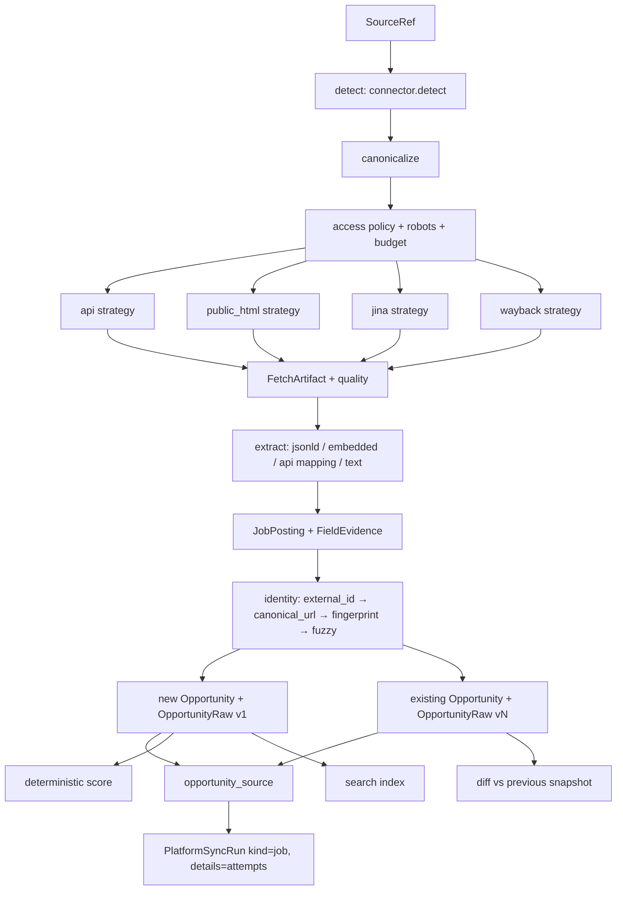
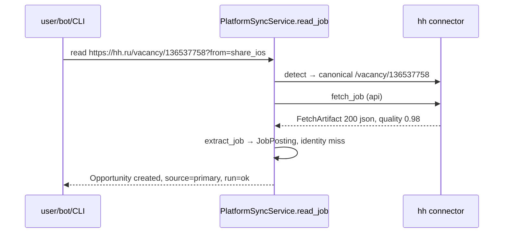
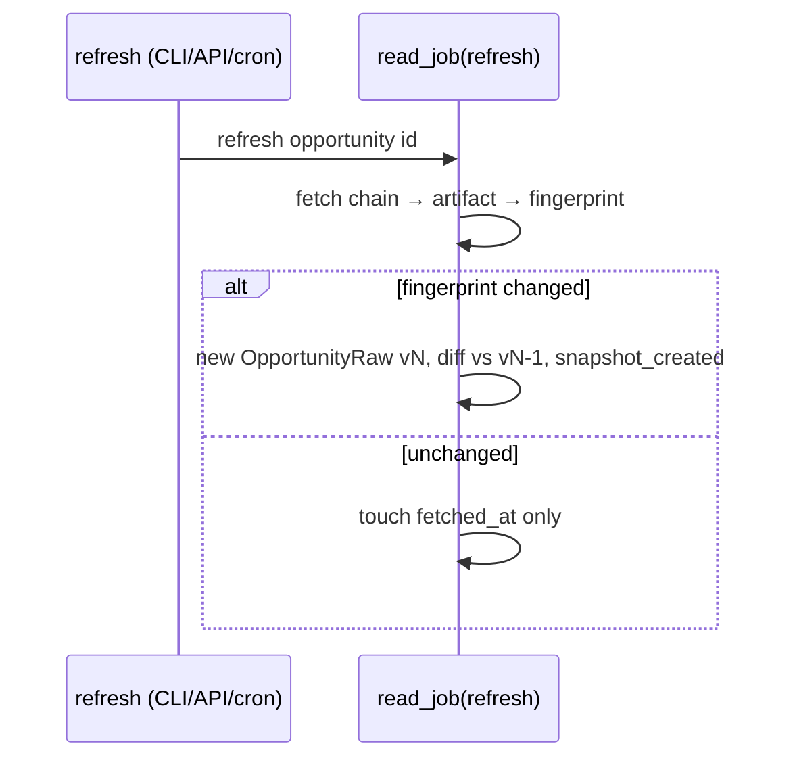
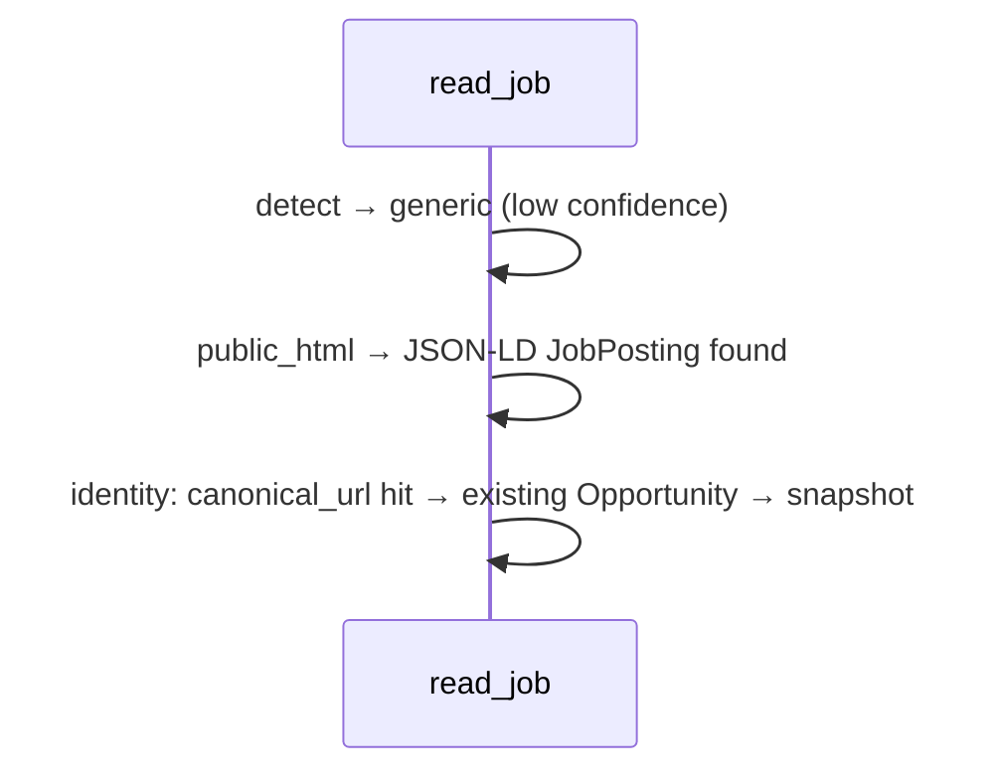

# Universal Job Intelligence — design / RFC (2026-08-26)

Status: accepted by the owner 2026-08-26 (plan review); implementation slice 1 = phases 0, A, D, E, B, C, G, H.
Origin: the root master prompt `CareerOS_ClaudeCode_Master_Prompt_Universal_Job_Intelligence.md`
(commit `6af984b`, 74 sections). This document is the repository-convention RFC it asks for (§6):
it records the current state (§72), the target architecture mapped onto existing code, the
decisions, and the acceptance criteria. Decisions are frozen in
[ADR-015](../../adr/015-public-job-url-reads.md) (user-initiated public job-URL reads, access
policy, fetch strategies) and [ADR-016](../../adr/016-job-provenance-snapshots.md) (job
provenance, snapshots, identity relations).

Related: [ADR-004](../../adr/004-platform-adapter-model.md), [ADR-005](../../adr/005-no-autonomous-platform-scraping.md),
[ADR-013](../../adr/013-platform-connectors.md), [platform connectors design](2026-08-25-platform-connectors-design.md),
[capabilities matrix](../../architecture/03-integration-capabilities-matrix.md), GitHub #21 (follow-ups; item 1 is
superseded by this design).

## 1. Context

The immediate problem is resilient reading of a *single vacancy* the user has found somewhere
(hh.ru share link, a RocketHunt page, a JustJoin offer, an employer careers page) into CareerOS with
provenance, so it can be scored, tracked and re-read later. The master prompt frames the broader
target as a **Universal Job Intelligence substrate**: acquisition (source → provider → strategy →
artifact → extraction → normalisation → validation) kept separate from provenance/merge/dedup/
snapshots, which are kept separate from analysis, CV matching and actions.

## 2. Current state (mandatory first report, §72)

Branch audit (§1–3, §63): local `main` only, `origin/main` only, no tags, no stashes. There is no
branch-only implementation of anything below; "archaeology" is trivial. Mainline = `main`.

Existing architecture that this design **extends, not replaces**:

| Concern | Where it lives today | Verdict |
|---|---|---|
| Provider system | `modules/platform`: `BaseConnector`, `Capabilities` (methods per `profile/jobs/applications` × `api/export/paste`), `PlatformRegistry.verify()` (declared ⇒ implemented), `ConnectorContext`, error taxonomy, 7 connectors | reuse — providers are connectors |
| HTTP | `platform/http.py`: `build_http`, `request_json` with bounded retry, backoff, `Retry-After`, injectable transport | reuse; add a `text/html` variant |
| Tokens/OAuth | `platform/tokens.py`, `oauth.py` (0600 file, env-pinned) | untouched |
| Canonical job | `opportunities.models.Opportunity` + `OpportunityExtraction` (Pydantic) | reuse as *the* job model |
| Raw artifact | `opportunities.models.OpportunityRaw` (immutable capture, `content_hash`, `capture_method`, `raw_payload`) | reuse as artifact store and snapshot row |
| Dedup | `opportunities/dedup.py`: `normalize_url`, `dedup_key`, `similarity` (rapidfuzz, threshold 92), `possible_duplicate_of` — never auto-merge | reuse; add layered identity |
| Ingest | `OpportunityService.ingest` → `parse_text` → optional AI `opportunity_extract` → dedup → deterministic score | reuse via `JobPosting.to_ingest()` |
| Sync orchestration | `platform/sync.py::PlatformSyncService` — the only platform→domain caller; jobs path skips re-ingest when `find_opportunity_id_by_url` hits | extend with `read_job` / `refresh` |
| Search | `modules/search` (Postgres FTS GIN + pgvector, `reindex`) | reuse for discovery over stored jobs |
| CRM | `modules/pipeline` (Application/ApplicationEvent/Interview, 18 stages) | untouched |
| Inbox | `modules/inbox` (Thread/Message, deterministic classify, AI refine < 0.6) | untouched in slice 1 |
| AI | `modules/ai` gateway (`structured()` validates in the gateway, provenance guard in `cv/provenance.py`, `Suggestion` states) | reuse for LLM fallback extraction only |
| Worker | ARQ runner, `core/tasks.py` registry — **empty**, no scheduler | add `opportunities/tasks.py` + cron behind a flag |
| Logging | structlog with `_redact` (tokens, cookies, `raw_text`, `body`) | reuse; add events |
| Cache | none (only `SearchDocument`) | add L1 in-process |
| MCP | none | backlog (phase I) |

Problems actually supported by repository evidence (§5):
* No read-by-URL at all — ADR-013 decision 5 explicitly deferred it (#21 item 1).
* No fetch-result model: connectors return `tuple[items, warnings]`; failures collapse into
  `UpstreamError` without attempt diagnostics.
* No source provenance on the job side: `external_id` is buried in `raw_payload`; no
  `platform`, `canonical_url`, `original_url`, fetched/published times, archive flag.
* No snapshots/diff: re-seeing a job either creates a second row or is skipped by exact URL match.
* URL normalisation asymmetry: `dedup_key` normalises, `find_opportunity_id_by_url` does not.
* No budgets/rate limiting beyond per-connector constants; no fetch cache; no refresh schedule.

## 3. Goals / non-goals / constraints

Goals: read one vacancy by a user-supplied URL through the highest legitimate strategy with full
provenance; support HH, JustJoin.it, RocketHunt and generic JSON-LD career pages; keep snapshots and
answer "what changed"; relate duplicates across aggregators and originals; expose the same
application service through CLI and REST (MCP later); tests without network; live tests behind a flag.

Non-goals: browser automation (Playwright) in any form; crawling listings/sitemaps; using
`/api/` endpoints that robots.txt disallows for bulk access; contact-gate bypass; CAPTCHA/WAF
bypass; cookies/passwords; auto-apply; Redis/S3/Meilisearch/Qdrant; a second Job domain; LLM as
the primary parser; recruiter-message model changes (backlog).

Constraints: CareerOS invariants 1–8 (`.claude/CLAUDE.md`); ADR-005; import-linter purity of
`platform.connectors` (extended to `platform.fetch` and `platform.sources`); single-user model;
shared working tree with parallel lanes (main-only, explicit paths, per-lane test DB).

## 4. Verified facts (2026-08-26) — provider research record

| Provider | Hosts / URL form | Public data | Access notes | Verified |
|---|---|---|---|---|
| RocketHunt | `rockethunt.ai/{en,ru}/vacancies/<uuid>` | Fully SSR (Next.js App Router; RSC payload in `self.__next_f`), **JSON-LD `JobPosting`** (title, url, datePosted, validThrough, description-markdown, employmentType, hiringOrganization, jobLocation, baseSalary min/max/currency/unitText, skills[], identifier=uuid, directApply=false, qualifications), RSC keys `grade, englishLevel, workFormat, relocation, experience_min/max_years, industry, specialization, companyType, companyWebsite, salary_estimated, avgSalary, source_name, source_type, showOriginal, applyOnSource, original, status, expired, published_at, updated_at, key_skills_en/ru, lang` | robots: `Allow: /`, `Disallow: /api/`, `/*/payment/`, `/*/profiles/`. ToS (26.01.2026, RF law): mass collection / automated access, copying without source link, building competing databases are prohibited. "Show contacts" gate present; no external hrefs on the page; org describes itself as aggregating Telegram posts. `/en/vacancies` listing is 404; sitemap lists ~8k vacancies (not used). Salary on the page is an aggregator estimate (`salary_estimated`/`avgSalary`). | 2026-08-26 |
| JustJoin.it | `justjoin.it/job-offer/<slug>` (to verify); API `GET /api/candidate-api/offers` (list, cursor pagination via `meta.next.cursor`, `per_page` ignored) and `/offers/<slug>` (detail: body, requiredSkills, niceToHaveSkills, employmentTypes[salary], applyUrl, url, publishedAt, expiredAt, isActive, workplaceType, workingTime, experienceLevel, category{key,parentKey}, locations, languages, companySize, companyUrl) | robots: `Disallow: /api/`; user ToS 14.07.2026 §1.2 (database protection), §11.3 (automated download without written consent prohibited). Legacy `/api/offers` → 404. | 2026-08-26 |
| HeadHunter | `hh.ru/vacancy/<id>` (+ tracking query, regional hosts) ; API `GET api.hh.ru/vacancies/{id}` | Structured API payload (existing `hh/client.py::vacancy`) | Anonymous API call returned **403 `forbidden`** from this workstation — app token / user token path required; direct HTML is not read (WAF/captcha, ADR-005) | 2026-08-26 |
| Jina Reader | `r.jina.ai/<url>` | Markdown rendering of a public page | anonymous 200; optional `JINA_API_KEY`; URL is sent to a third party ⇒ public URLs only | 2026-08-26 |
| Wayback | `web.archive.org/cdx/search/cdx` + `web.archive.org/web/<ts>id_/<url>` | Historical snapshots | capture timestamp ≠ publication date; result is *historical* | design |

## 5. Target architecture



Stages are separate functions/modules; there is no `scrape_and_analyze_job()`.

### 5.1 Source abstraction (`platform/sources.py`, pure)
`SourceKind = url | provider_id | search_result | api | html | markdown | text | email |
telegram_message | manual | archive | repost`. `SourceRef(kind, value, provider_hint, metadata,
parent)` — a source may reference another (RocketHunt → original posting). `CanonicalSource(platform,
external_id, canonical_url, locale, host)`. `DetectionResult(platform, confidence, canonical)`.
`detect(url, registry)` asks every connector's `detect()`; the generic connector answers with low
confidence for any http(s) URL, so there is no central hostname `if/elif`.

### 5.2 Provider architecture (extends `BaseConnector`)
* `Capabilities.read_job: list[FetchStrategy]` (ordered, best first) and `Capabilities.access:
  AccessMode = public | authenticated_user_api | manual_import | unsupported`.
* New overridables: `detect(url) -> DetectionResult | None`, `canonicalize(source) ->
  CanonicalSource`, `fetch_job(ctx, source, budget) -> JobRead` (default implementation runs the
  declared strategies in order and stops at the first artifact whose quality is sufficient),
  `extract_job(artifact) -> JobPosting`.
* `PlatformRegistry.verify()` additionally asserts: `read_job` declared ⇒ `detect` and
  `extract_job` overridden; `public_html`/`jina`/`wayback` declared ⇒ `access == public`.

### 5.3 Fetch strategies (`platform/fetch/`, pure)
`FetchStrategy = api | public_html | jina | wayback | archive_today | search_recovery` (the last two
are enum members only in slice 1). Each strategy implements `async run(ctx, source, budget) ->
FetchArtifact`. `FetchArtifact(provider, strategy, requested_url, resolved_url, external_id,
fetched_at, status_code, content_type, raw_text, raw_json, is_archive, archive_ts, cache_status,
duration_ms, quality, completeness, error_type, error_message)` never carries headers or cookies.
`quality.py` rejects captcha / login / cookie-interstitial / WAF / empty JS shell / closed-job /
search-result pages: **HTTP 200 is not a vacancy**. `FetchBudget(max_attempts, max_total_s,
max_archive_calls, max_search_calls)` bounds the chain; native API success never waits for archives.
`robots.py` checks `robots.txt` (cached per host, CareerOS user agent) before `public_html`.
`cache.py`: L1 in-process TTL cache keyed by `(provider, strategy, canonical_url, locale)`, with a
short negative TTL for 404/captcha; captcha HTML is never cached as success. Persistent artifacts
are `OpportunityRaw` rows.

Strategy order per provider (slice 1): RocketHunt `public_html → jina → wayback`; HH `api → jina →
wayback` (jina/wayback only after the API said 404/403 and nothing was recovered); JustJoin `api →
public_html → wayback`; generic `public_html → jina → wayback`.

### 5.4 Extraction (deterministic first, §19)
`extract/jsonld.py` maps schema.org `JobPosting` → `OpportunityExtraction` + `FieldEvidence`;
`extract/embedded.py` reads `__NEXT_DATA__`, RSC `self.__next_f` chunks and `__NUXT__` tolerantly
(best effort, drift-tested by key set); `extract/text.py` feeds readable text to the existing
`parse_text`. LLM extraction (`AIService.structured("opportunity_extract")`) is a fallback only
when deterministic extraction is incomplete and the user asked for AI (`use_ai`).

### 5.5 Provenance, authority, conflicts (ADR-016)
Per job: `opportunity_source` rows (`platform, external_id, source_url, canonical_url,
original_url, relation, authority, strategy, raw_id, fetched_at, published_at, content_hash,
is_archive, confidence`). Authority order (guideline): employer ATS/API > employer page > native
board structured source > current HTML > aggregator > archive > search result > LLM inference.
Per field: `Opportunity.field_evidence` JSONB `{field: [{value, source, source_url, observed_at,
confidence}]}`; disagreements are kept, never last-write-wins; the aggregator salary estimate of
RocketHunt is recorded as `source="aggregator_estimate"` and never presented as an employer fact.

### 5.6 Snapshots and change history (ADR-016)
`OpportunityRaw` becomes the snapshot row: `opportunity_id`, `fingerprint` (normalised content
without volatile noise), `strategy`, `fetched_url`, `resolved_url`, `is_archive`, `archive_ts`,
`quality`, `extracted` (the `OpportunityExtraction` at capture time). A refresh creates a new raw
only when the fingerprint changed; `diff(a, b)` reports salary/remote/requirements/location/apply
URL/closed changes from `extracted`.

### 5.7 Identity / dedup
Layered evidence in order: exact `(platform, external_id)` → normalised `canonical_url` → company +
title + location → fingerprint → fuzzy (`similarity ≥ 92`) → semantic (search embeddings; suggestion
only). Relations: `primary | aggregates | repost_of | same_as | mirror | historical_version_of |
possible_duplicate`. Weak matches are flagged, never merged.

### 5.8 Discovery
`JobQuery` gains `skills, seniorities, currencies, published_after, provider_filters`; connectors
map only the filters they support and never fake the rest. RocketHunt and JustJoin expose
`search_url` deep links only (ADR-015: no listing access).

### 5.9 Surfaces
CLI: `careeros platform read <url> [--dry-run --json --show-attempts --no-cache --strategy]`,
`careeros platform detect <url>`, `careeros platform refresh <id>`, `careeros platform doctor <p>`.
REST: `POST /api/platform/read`, `GET /api/platform/detect`, `GET /api/opportunities/{id}/sources|
snapshots|diff`, `POST /api/opportunities/{id}/refresh`. Bot: a forwarded URL that `detect()`
recognises goes through `read_job`. MCP (backlog): thin stdio server over the same services.

### 5.10 Observability, privacy, access policy
structlog events `provider_attempt / provider_success / provider_failure / fallback_selected /
cache_hit / cache_miss / rate_limit / snapshot_created / duplicate_detected / merge_conflict /
llm_extraction` with `provider, strategy, host, duration_ms, status_code, attempt, quality,
cache, failure_type`; attempts are also stored in `PlatformSyncRun.details`. No secrets in logs
(`_redact`); artifacts store no headers/cookies; `job_fetch_raw_retention_days` bounds raw
retention. Access policy per provider is data (`Capabilities.access`) and enforced before any
network call; unsupported modes fail clearly.

## 6. Sequence diagrams



```mermaid
sequenceDiagram
    participant S as read_job
    participant R as rockethunt connector
    S->>R: public_html GET /en/vacancies/<uuid>
    R-->>S: 200 SSR + JSON-LD (quality 0.9)
    S->>S: extract jsonld + embedded; original source key present?
    S->>S: opportunity_source(primary=rockethunt) + (aggregates → original_url if public)
    S-->>S: contacts gate untouched
```

```mermaid
sequenceDiagram
    participant S as read_job
    participant P as provider
    S->>P: api / public_html
    P-->>S: 404 closed
    S->>P: jina (if enabled, public URL)
    P-->>S: closed page → unusable
    S->>P: wayback CDX → latest usable snapshot
    P-->>S: artifact is_archive=true, archive_ts
    S-->>S: JobPosting marked historical/closed; status=closed
```





## 7. Storage, migration, rollout

One Alembic migration off the current head (`b1c7d0e9a4f2` at design time — re-check before
creating): new table `opportunity_source`; new nullable columns on `opportunity` (`platform`,
`external_id`, `canonical_url`, `field_evidence`) and `opportunity_raw` (`opportunity_id`,
`fingerprint`, `strategy`, `fetched_url`, `resolved_url`, `is_archive`, `archive_ts`, `quality`,
`extracted`). Backfill: every existing `Opportunity` gets one `opportunity_source(relation=primary)`
from `source/url/raw_payload.external_id`; `raw.opportunity_id` is set; no duplicates are created.
Existing applications, notes, scores and CV links are untouched. Rollout: behind
`CAREEROS_JOB_FETCH_*` flags; `make all` stays green on a fresh install (new connectors report
`SKIPPED` without input).

## 8. Testing

Unit: URL detection/canonicalisation, provider selection, JSON-LD/embedded parsing, quality
scoring (captcha/login/shell), salary/remote normalisation, provenance rows, conflicts, dedup
layers, fingerprints, snapshots/diff, retry, cache, robots, budgets. Fixtures (sanitised): HH API
200/403/404, HH captcha page, JustJoin detail + schema-drift variant with unknown category/
currency/contract, RocketHunt public vacancy (en + ru + 404), generic JSON-LD JobPosting, Wayback
CDX + snapshot, Jina text. Live tests: `@pytest.mark.live`, run only with `CAREEROS_LIVE_TESTS=1`,
accept current/closed/archive/blocked outcomes while validating diagnostics. Mandatory: §53 HH
canonicalisation of `136537758?from=share_ios` without network; §54 JustJoin contract variations;
§55 RocketHunt — "Show contacts" is never interpreted as recovered contact data, `/api/` is never
called.

## 9. Risks / open questions

* ToS exposure remains with the owner even for read-one (broad "automated access" wording);
  mitigations: per-provider kill switch, identifying user agent, cache, ≤1 request per URL per TTL.
* HH anonymous 403: may be regional or app-registration related; `jobs_without_token` must degrade
  to `SKIPPED` in `platform sync all`.
* RSC payload parsing is brittle by nature — JSON-LD is primary; a key-set drift test guards it.
* `Platform` enum growth changes generated vault schemas and TS types — regenerate with
  `make contracts` in the same commit (agreed with the assistant lane).
* Open: archive.today / search-recovery worth implementing at all; MCP slice timing.

## 10. Acceptance criteria (§71, adapted)

Job acquisition is provider-based; HH is not special-cased at the application layer; RocketHunt
public vacancies import with provenance and the contacts gate untouched; JustJoin read-one verified
from fixture; generic JSON-LD supported; captcha/login/error pages rejected; archive data marked
historical; conflicts kept; snapshots preserve meaningful changes; duplicates across aggregators/
originals related; existing applications usable; unit tests need no network; live tests optional;
CLI/API share one service; no secrets in logs; no anti-bot circumvention; docs explain adding a
provider; doctor explains what succeeded and why.
